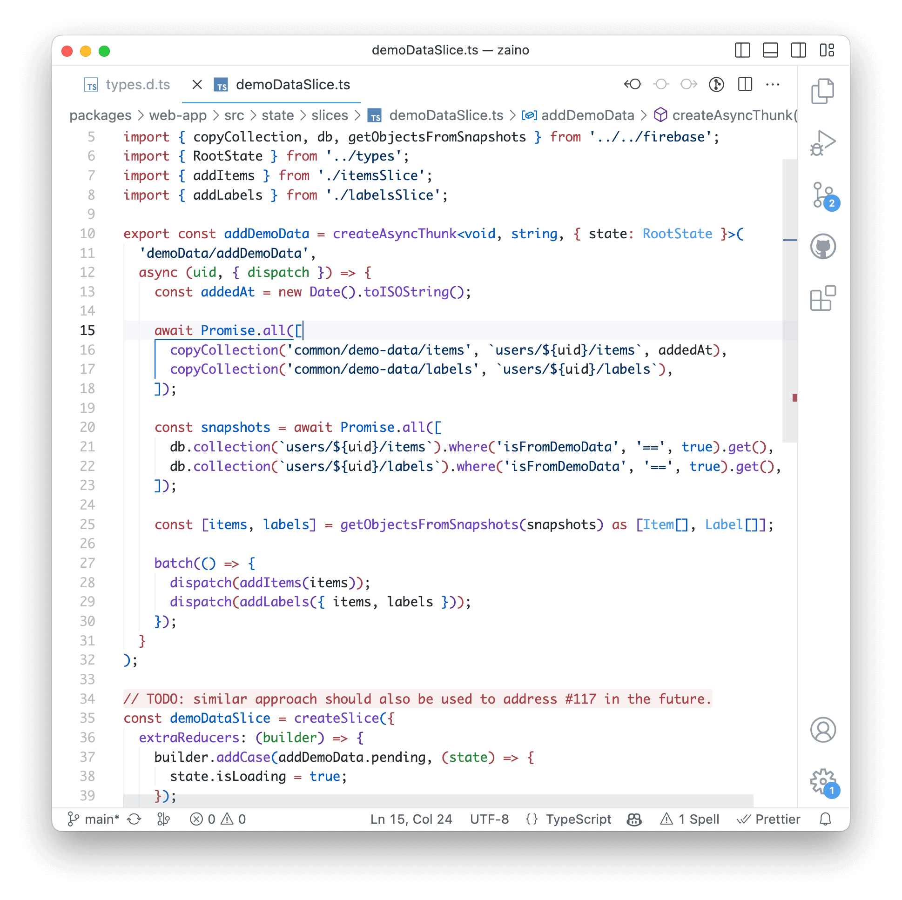
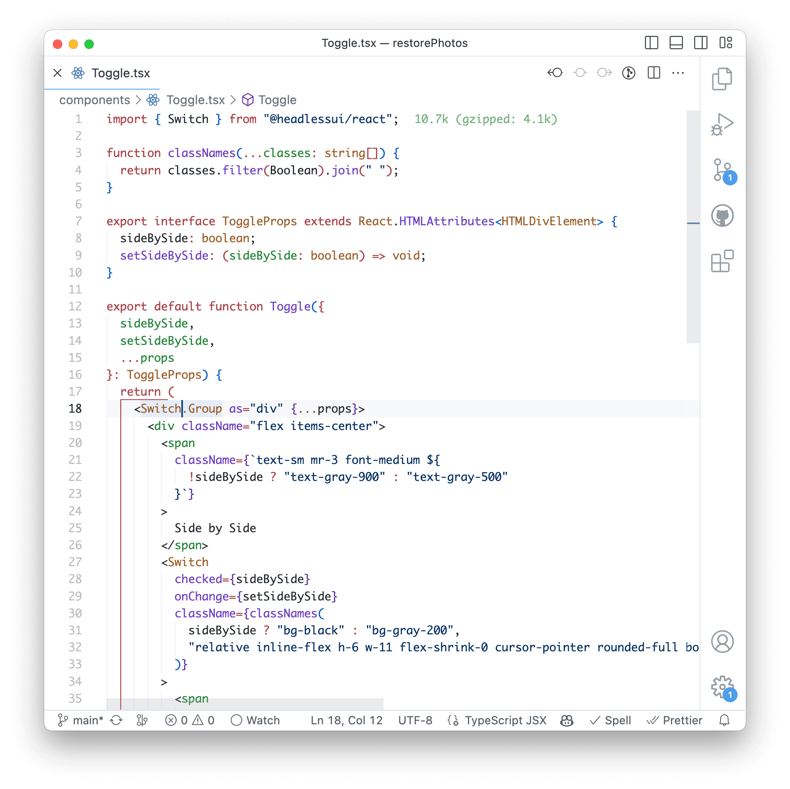
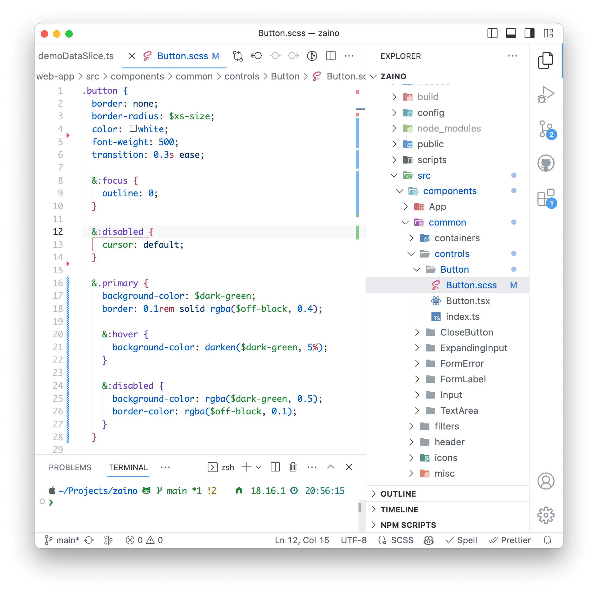

# Github Soft Theme

A modern light theme for [Visual Studio Code](http://code.visualstudio.com/) with lower saturation colors. Designed to be easy on the eyes. Based on [GitHub Theme](https://marketplace.visualstudio.com/items?itemName=GitHub.github-vscode-theme). Other sources of inspiration are [Nord](https://marketplace.visualstudio.com/items?itemName=arcticicestudio.nord-visual-studio-code), [Nord Light](https://marketplace.visualstudio.com/items?itemName=huytd.nord-light) and [Vitesse Theme](https://marketplace.visualstudio.com/items?itemName=antfu.theme-vitesse).

The theme also offers a flatter UI with a uniform white color for panels and sidebar.

## Install

1. Open the theme page on [VSCode Marketplace](https://marketplace.visualstudio.com/items?itemName=IgorKrupenja.vscode-github-soft-theme).
2. Click on the "Install" button and wait for the installation to complete.
3. Choose "Github Soft" from the list that appears.

## Screenshots

### TypeScript



### React TSX



### SCSS, panel and sidebar



## Recommended settings for other extensions

### [Material Icon Theme](https://marketplace.visualstudio.com/items?itemName=PKief.material-icon-theme)

```json
"material-icon-theme.saturation": 0.6,
```

### [TODO Highlight](https://marketplace.visualstudio.com/items?itemName=wayou.vscode-todo-highlight)

```json
"todohighlight.defaultStyle": {
  "color": "#A74047",
  "backgroundColor": "#A7404730",
  "overviewRulerColor": "#A74047",
  "borderRadius": "2px"
},
```

### [Import Cost](https://marketplace.visualstudio.com/items?itemName=wix.vscode-import-cost)

```json
"importCost.largePackageLightColor": "#A74047AA",
"importCost.mediumPackageLightColor": "#DBAB09AA",
"importCost.smallPackageLightColor": "#22863AAA",
```

### [Git Graph](https://marketplace.visualstudio.com/items?itemName=mhutchie.git-graph)

```json
"git-graph.graph.colours": [
  "#D73A4A",
  "#28A745",
  "#DCAB07",
  "#0366D6",
  "#5B32A3",
  "#1C7C82"
],
```

## Customization

To customize this theme, refer to the [color theme documentation](https://code.visualstudio.com/api/extension-guides/color-theme). A detailed list of available color customizations is [here](https://code.visualstudio.com/api/references/theme-color). This allows you to conveniently make minor adjustments to the theme without the need to create and manage your own theme repository.

### Semantic highlighting

[Semantic highlighting](https://code.visualstudio.com/api/language-extensions/semantic-highlight-guide) is **disabled** for this theme by default. I found the feature too colorful and distracting. If you want to enable it, add the following to your settings:

```json
"editor.semanticHighlighting.enabled": true,
```

It can also be enabled per-language if needed, for example:

```json
"[typescript]": {
  "editor.semanticHighlighting.enabled": true
},
```

## Change log

See [CHANGELOG.md](CHANGELOG.md) for details.

## 0.2.0

- Added suggestions for [Git Graph](https://marketplace.visualstudio.com/items?itemName=mhutchie.git-graph) extension.
- Changed object property color to a less saturated one.

## 0.1.7

- Fixed colors of some active element indicators.
- Fixed title bar border color.

## To do

- Investigate changing markdown preview code block colors, [#8](https://github.com/IgorKrupenja/vscode-github-soft-theme/issues/8)

## Feedback

If you like the theme, you add a review here or star on [Github](https://github.com/IgorKrupenja/vscode-github-soft-theme).

If you have suggestions, please open an [issue](https://github.com/IgorKrupenja/vscode-github-soft-theme/issues/new) or, even better, a [pull request](https://github.com/IgorKrupenja/vscode-github-soft-theme/pulls).

You can also create issues or Readme PRs for other extensions that you think should be included in the recommended settings.
